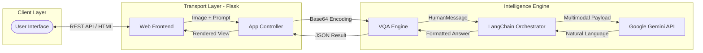
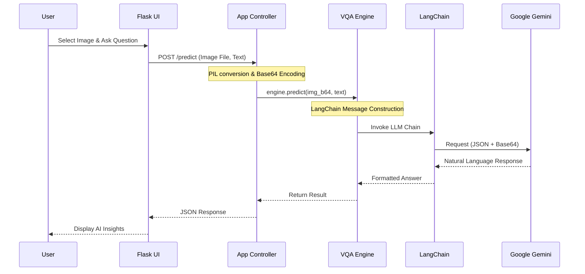

# Multimodal AI: Visual Question Answering with Gemini & LangChain

[](https://github.com/nikhil383/multimodal-ai/actions/workflows/ci.yml)
[](https://www.python.org/downloads/)
[](https://opensource.org/licenses/MIT)

A high-performance, production-ready implementation of a **Multimodal VQA (Visual Question Answering) system**. This project leverages the **Google Gemini Pro Vision** (via Gemini 2.0/1.5 Flash models) orchestrated by **LangChain** to provide an intelligent interface for reasoning over visual data.

---

## Overview

This repository demonstrates how to build and deploy modern AI applications using industry-standard engineering practices. It moves beyond simple notebooks to a robust, modular architecture suitable for production environments.

### Key Capabilities
- **Visual Reasoning**: Interpret complex images and answer context-aware questions.
- **API-First Design**: Optimized for low-latency response using state-of-the-art hosted LLMs.
- **Engineering Rigor**: Includes full test coverage, containerization, and automated CI/CD pipelines.

## Technology Stack

| Category | Tools & Frameworks |
| :--- | :--- |
| **AI / LLM** | Google Gemini API, LangChain (Orchestration) |
| **Backend** | Flask (Python), Python Dotenv |
| **Tooling / Env** | UV (High-speed package manager), Makefile |
| **DevOps** | Docker, GitHub Actions (CI/CD) |
| **Testing** | Pytest, Unittest Mock |

## Architecture

The system is designed with a clear separation between the web interface, the application logic, and the intelligence engine.



### Execution Flow



## Engineering Excellence

This project showcases several advanced software engineering practices:

- **Ultra-Fast Dependency Management**: Uses `uv` for deterministic builds and near-instant package installation.
- **Containerization**: A multi-stage `Dockerfile` (or optimized single-stage) ensures the app runs everywhere.
- **Automated Quality Gate**: GitHub Actions automatically run linting and unit tests on every push.
- **Robust Testing**: Implements mock-based testing for external API calls, ensuring high reliability without incurring API costs during CI.
- **Clean Code**: Adheres to modular design patterns, isolating the ML logic from the transport layer.

## Getting Started

### Prerequisites
- Python 3.11+
- [UV](https://github.com/astral-sh/uv) (Recommended) or `pip`
- Google Gemini API Key (Get one at [Google AI Studio](https://aistudio.google.com/))

### Installation

1. **Clone and Enter**
   ```bash
   git clone https://github.com/nikhil383/multimodal-ai.git
   cd multimodal-ai
   ```

2. **Setup Environment**
   ```bash
   make install  # or: uv sync
   ```

3. **Configure API Key**
   Create a `.env` file from the template:
   ```bash
   cp .env.example .env
   # Open .env and add your GOOGLE_API_KEY
   ```

### Execution

**Start the Development Server:**
```bash
make run
```
Access the interface at `http://localhost:5000` (or the port specified in your console).

## Testing & Quality Assurance

**Run Test Suite:**
```bash
make test
```

**Quality Check (Linting & Formatting):**
```bash
make format
```

## Project Structure

```text
multimodal-ai/
├── src/
│   ├── app.py          # Flask application and entry point
│   ├── model.py        # VQA Engine (Gemini + LangChain logic)
│   ├── templates/      # Frontend HTML
│   └── static/         # Frontend CSS/JS
├── tests/              # Automated unit tests
├── .github/            # GitHub Actions CI/CD workflows
├── pyproject.toml      # Modern Python dependency definition
├── Makefile            # Workflow automation commands
└── Dockerfile          # Container definition
```

---

## Roadmap
- [ ] Implement support for local multimodal models (Ollama integration).
- [ ] Add conversation history support (ChatBufferMemory).
- [ ] Enhance UI with real-time streaming responses.
- [ ] Add evaluation metrics for VQA accuracy.

---
**Maintained by**: [Nikhil](https://github.com/nikhil383)
