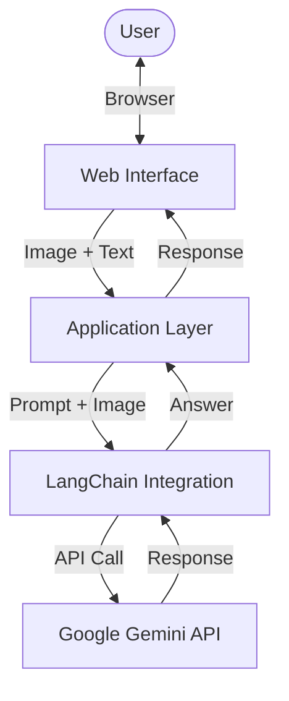

# Multimodal AI – Visual Question Answering Demo

[](https://github.com/nikhil383/multimodal-ai/actions/workflows/ci.yml)


A professional, end-to-end implementation of a Visual Question Answering (VQA) system using **Google Gemini API** and **LangChain**. This project demonstrates modern AI engineering practices including modular design, automated testing, and containerization.

---

## 🏗 Architecture



## 🚀 Features

- **Production-Ready Structure**: Clean separation of concerns (`src/app.py`, `src/model.py`).
- **Robust Testing**: Unit tests included for core model logic (`tests/`).
- **DevOps Integrated**: `Makefile` for one-command workflows and Docker support.
- **CI/CD**: Automatic testing and linting via GitHub Actions.

## 🛠 Installation

1. **Clone the repository**
   ```bash
   git clone https://github.com/nikhil383/multimodal-ai.git
   cd multimodal-ai
   ```

2. **Install dependencies** (using `uv` is recommended)
   ```bash
   make install
   # Or manually: uv sync
   ```

3. **Configuration**
   Create a `.env` file in the project root and add your Google API key:
   ```bash
   cp .env.example .env
   # Edit .env and set GOOGLE_API_KEY
   ```

## 🏃 Running the App

Start the server locally:
```bash
make run
```
Open [http://localhost:7860](http://localhost:7860) in your browser.

## 🧪 Testing & Quality

Run the test suite:
```bash
make test
```

Check code formatting:
```bash
make format
```

## 🐳 Docker Support

Build and run the containerized application:
```bash
make docker-build
docker run -p 7860:7860 multimodal-ai
```

## 📂 Project Structure

- `src/`: Application source code.
  - `model.py`: Encapsulates the ML model logic.
  - `app.py`: Handles the web interface.
- `tests/`: Automated tests.
- `.github/`: CI/CD configurations.
- `Makefile`: Command aliases for development.

---
**License**: MIT
